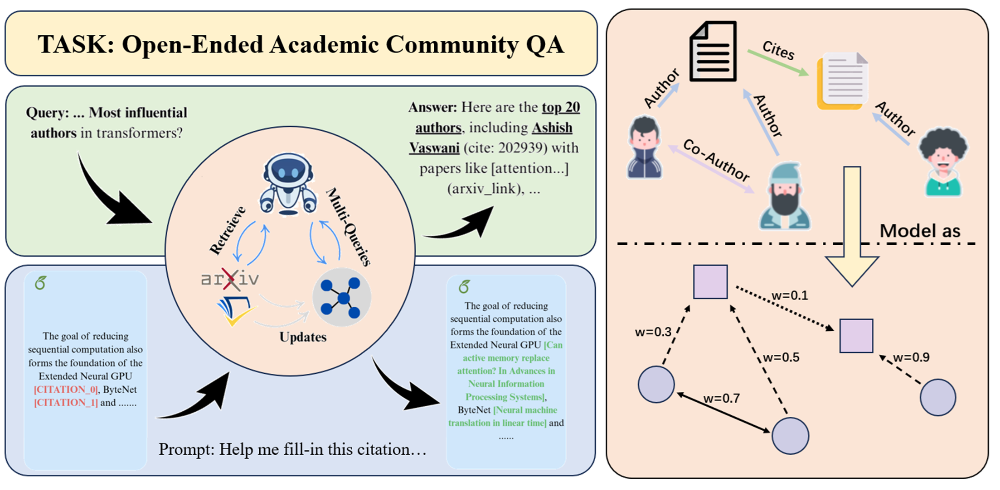

# Academic-Nuggets
Free-Form,Graph-Enhanced QA on Academic Community & A toolset for academic citation fill-in research and evaluation.

---
[Sihan Ren*]() | [Siyuan Xie]() | [Xiaoyuan Liu]()
[📄 Paper](https://github.com/Tabiiiqwq/CitationNuggets) | [🎥 Video](https://drive.google.com/file/d/1u2jQzKAtWvAdZCUxks5R9zMw1yJFmAOu/view?usp=drive_link) | [📊 Slides](https://drive.google.com/file/d/19gIjVqUL8W3gXb0Yeq1PK_DZJcrVBJbT/view?usp=drive_link)



## Project Structure

```
Academic-Nuggets/
├── data/
│   ├── input/                    # Input data (HTML academic papers)
│   └── output/                   # Processed data and datasets
├── src/
│   ├── dataset_construction/     # Tools for building datasets
│   ├── evaluation/               # Evaluation metrics and tools
│   ├── methods/                  # Citation prediction methods
│   └── utils/                    # Utility functions
└── tests/                        # Test files and examples
```

## Our Method

Our citation prediction method is implemented in the `src/methods/` directory...

## Quick Start

The quickest way to run an evaluation of different citation prediction methods is to use the `run_coverage_test.py` script:

```bash
python run_coverage_test.py
```

This script will:
1. Load the test dataset from `data/output/dataset_coverage/`
2. Initialize the coverage evaluator
3. Evaluate specified methods (currently `naive_llm_based` and `search_based`)
4. Compare methods and generate metrics and visualizations

## Using the CLI

The project provides a comprehensive command-line interface through `main.py` with the following functionality:

### Process HTML Papers

Process HTML papers to extract citations and create different versions (full paper, sections, paragraphs).

```bash
python main.py process_papers --input_dir=data/input/ACL_papers/html --output_dir=data/output/processed_ACL_html
```

### Build Dataset

Build a citation dataset from processed papers with train/val/test splits and huggingface format dataset.

```bash
python main.py build_dataset --processed_dir=data/output/processed_ACL_html --output_dir=data/output/dataset_coverage
```

### Evaluate Methods

Run coverage evaluation on one or more citation prediction methods.

```bash
python main.py run_coverage_evaluation --test_data_path=data/output/dataset_coverage --output_dir=eval/coverage_results --methods=["method1", "method2"]
```

### Custom Method Evaluation

You can evaluate your own citation prediction method by implementing a function that:
1. Takes a masked text as input (where citations are marked as `[CITATION]`)
2. Returns a list of paper titles that should be cited at those positions

```python
def my_custom_method(masked_text: str) -> List[str]:
    # Your citation prediction logic here
    # ...
    return ["Paper Title 1", "Paper Title 2", ...]
```

Then evaluate it using:

```bash
# First, import your method in main.py
# Then run:
python main.py run_coverage_evaluation --test_data_path=data/output/dataset_coverage --output_dir=eval/my_results --methods=["my_custom_method"]
```

## Building Custom Datasets

You can build your own datasets using collected arXiv HTML files:

1. Collect HTML papers (e.g., from arXiv)
2. Process them using the `process_papers` command
3. Build a dataset using the `build_dataset` command
4. Evaluate methods using the new dataset

```bash
# Process your HTML papers
python main.py process_papers --input_dir=path/to/your/html/papers --output_dir=data/output/my_processed_papers

# Build dataset
python main.py build_dataset --processed_dir=data/output/my_processed_papers --output_dir=data/output/my_dataset

# Evaluate methods on your dataset
python main.py run_coverage_evaluation --test_data_path=data/output/my_dataset --output_dir=eval/my_results --methods=["my_custom_method"]
```

## Requirements

See `requirements.txt` for a list of required packages.
